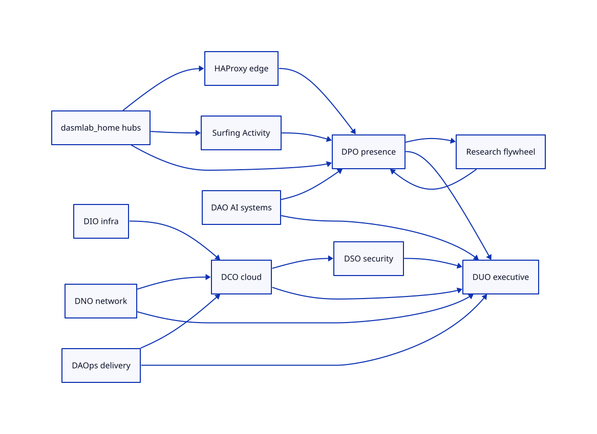
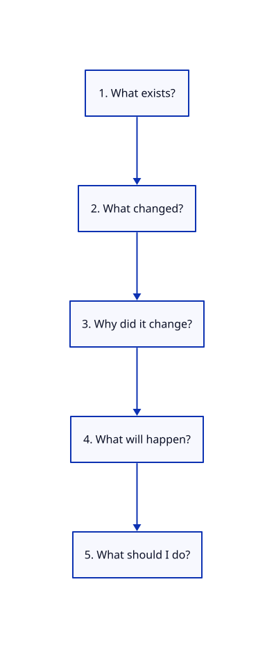
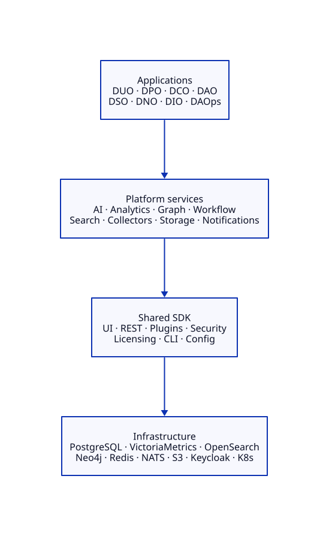
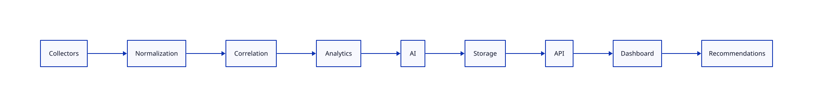

# E2E platform story — Observatory family chain

Engineering platforms that make complex systems observable, understandable, automatable, and ultimately self-improving. This story is the **compelling chain** across DXX products — not a mash of dashboards.

## Five questions (every hop)

1. What exists?
2. What changed?
3. Why did it change?
4. What will happen?
5. What should I do?

## Story beats (~10 min demo)

| # | Beat | Product | Novel signal (not commodity) |
|---|------|---------|------------------------------|
| 1 | Engineer ships hub or operator change | home / GitOps | change event |
| 2 | Presence moves — sitemap, bots, Activity, GitHub; baseline diff | **DPO** | Topic Coverage, crawl diversity |
| 3 | Same window — deploy confidence / complexity | **DCO** | Deployment Confidence, Operational Complexity |
| 4 | Surface / secrets shift with FQDN or image | **DSO** | Attack Surface Evolution, Secrets Hygiene |
| 5 | Path HAProxy→Route stability / CERT intent | **DNO** | Service Reachability, Intent Compliance |
| 6 | Internal AI pack health vs external citations | **DAO** + DPO | Prompt Effectiveness vs Citation Velocity |
| 7 | CI queue / toil graded the risky window | **DAOps** | Delivery Confidence, Toil Ratio |
| 8 | Capacity / dual-cluster readiness | **DIO** | Capacity Confidence, Failover Readiness |
| 9 | Executive impact chain + one action | **DUO** | Business→Engineering→Operational + recommendation |
| 10 | Quarterly index feeds authority back | **Research** → DPO | AI Citation Index flywheel |

## Architecture reminder

Same pipeline in every Observatory. Thin products. Shared SDKs.

## APIs for the story

- `GET /api/v1/family` — products + existence-proof features
- `GET /api/v1/duo/impact` — composed impact chain
- `GET /api/v1/duo/recommend` — explainable recommendation (≥2 products)
- DPO: `/api/v1/content`, `/api/v1/baseline`, `/api/v1/engineering`

## Walkthrough

See [E2E-DEMO.md](./E2E-DEMO.md).
