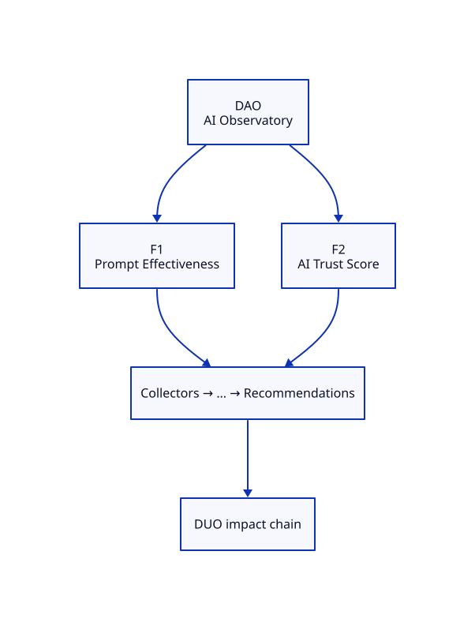

# DAO — AI Observatory Blueprint

**ADR:** 0500 · **Status:** scaffold · **Maturity target:** L1→L2

## Mission

Prove existence as a specialization of DOP: measure what commodity tools ignore (Prompt logs alone are inputs only).

## Novel scores

Prompt Effectiveness, AI Trust Score, Model Drift, …

## Features (≥2)

| Feature | Novel signal | Five-question focus | Proof |
|---------|--------------|---------------------|-------|
| **Prompt Effectiveness** | Prompt Effectiveness | What exists?, What changed?, Why did it change?, What should I do? | Versioned packs in docs/PROMPTS.md + Labs outcome records |
| **AI Trust Score** | AI Trust Score | What exists?, What will happen?, What should I do? | Citation accuracy / knowledge freshness stubs for internal assistants |

### Feature details

#### F1 — Prompt Effectiveness
- **Chain role:** Internal AI quality; distinct from DPO GEO
- **Acceptance:** See [USE-CASES.md](./USE-CASES.md)

#### F2 — AI Trust Score
- **Chain role:** DUO shows DAO (our AI) beside DPO (AI about us)
- **Acceptance:** See [USE-CASES.md](./USE-CASES.md)

## Dependencies

Labs GEO pack, official AI APIs only

## E2E chain role

Same week: DAO internal trust + DPO external citations

## Demo steps (local)

1. Open Family tab → locate **DAO** card and two features.
2. Hit APIs listed in USE-CASES.
3. Confirm novel score names appear (never commodity-only heroes).

## ADR-9999 gate

Both features satisfy Measure and/or Correlate and/or Explain; neither is a commodity dashboard.
