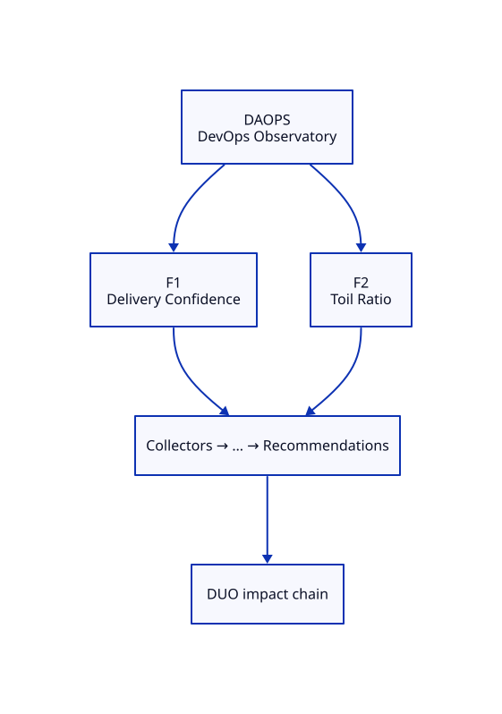

# DAOPS — DevOps Observatory Blueprint

**ADR:** 0650 · **Status:** scaffold · **Maturity target:** L2

## Mission

Prove existence as a specialization of DOP: measure what commodity tools ignore (Pipeline green/red alone are inputs only).

## Novel scores

Delivery Confidence, Toil Ratio, Platform Friction, …

## Features (≥2)

| Feature | Novel signal | Five-question focus | Proof |
|---------|--------------|---------------------|-------|
| **Delivery Confidence** | Delivery Confidence | What changed?, Why did it change?, What will happen?, What should I do? | CX success rate / queue time on bld-249 for observatory + home |
| **Toil Ratio** | Toil Ratio | What exists?, Why did it change?, What should I do? | Manual workflow_dispatch / cert ensures vs auto GitOps publishes |

### Feature details

#### F1 — Delivery Confidence
- **Chain role:** Explains risky DPO/DCO windows
- **Acceptance:** See [USE-CASES.md](./USE-CASES.md)

#### F2 — Toil Ratio
- **Chain role:** Friction → DUO engineering impact
- **Acceptance:** See [USE-CASES.md](./USE-CASES.md)

## Dependencies

GitHub Actions API / runner metrics

## E2E chain role

CI pain explains deploy/presence risk windows

## Demo steps (local)

1. Open Family tab → locate **DAOPS** card and two features.
2. Hit APIs listed in USE-CASES.
3. Confirm novel score names appear (never commodity-only heroes).

## ADR-9999 gate

Both features satisfy Measure and/or Correlate and/or Explain; neither is a commodity dashboard.
