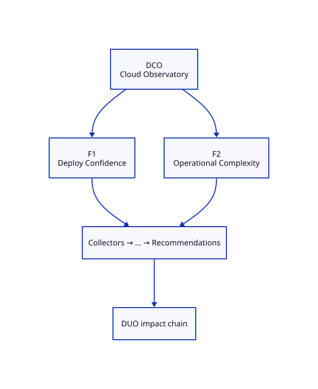

# DCO — Cloud Observatory Blueprint

**ADR:** 0100 · **Status:** live · **Maturity target:** L1→L2

## Mission

Prove existence as a specialization of DOP: measure what commodity tools ignore (CPU, Memory, Pods alone are inputs only).

## Novel scores

Operational Complexity, Deployment Confidence, Recovery Confidence, …

## Features (≥2)

| Feature | Novel signal | Five-question focus | Proof |
|---------|--------------|---------------------|-------|
| **Deploy Confidence** | Deployment Confidence | What changed?, Why did it change?, What will happen?, What should I do? | Correlate GitOps image rollout ↔ pod ready/restarts for dpo-system |
| **Operational Complexity** | Operational Complexity | What exists?, What changed?, What should I do? | Count Deployments, PVCs, Routes, Secrets, CronJobs in watched ns |

### Feature details

#### F1 — Deploy Confidence
- **Chain role:** Same window as DPO ship → cluster cost of presence change
- **Acceptance:** See [USE-CASES.md](./USE-CASES.md)

#### F2 — Operational Complexity
- **Chain role:** Complexity index → DUO engineering impact
- **Acceptance:** See [USE-CASES.md](./USE-CASES.md)

## Dependencies

OpenShift API / Argo, live-cicd manifests

## E2E chain role

DPO image change window → DCO deploy confidence

## Demo steps (local)

1. Open Family tab → locate **DCO** card and two features.
2. Hit APIs listed in USE-CASES.
3. Confirm novel score names appear (never commodity-only heroes).

## ADR-9999 gate

Both features satisfy Measure and/or Correlate and/or Explain; neither is a commodity dashboard.
