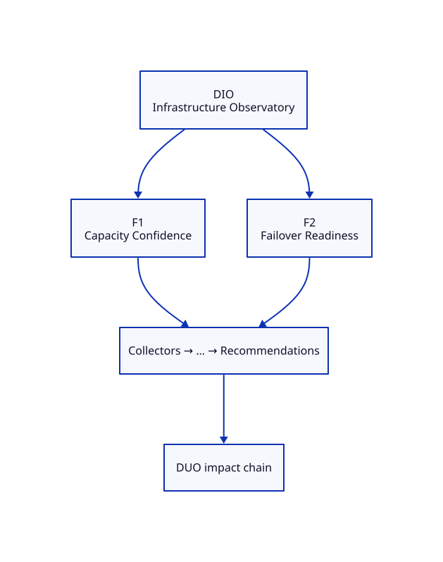

# DIO — Infrastructure Observatory Blueprint

**ADR:** 0600 · **Status:** scaffold · **Maturity target:** L1→L2

## Mission

Prove existence as a specialization of DOP: measure what commodity tools ignore (Disk / host metrics alone are inputs only).

## Novel scores

Capacity Confidence, Failover Readiness, …

## Features (≥2)

| Feature | Novel signal | Five-question focus | Proof |
|---------|--------------|---------------------|-------|
| **Capacity Confidence** | Capacity Confidence | What exists?, What will happen?, What should I do? | PVC/LVMS usage for observatory namespaces |
| **Failover Readiness** | Failover Readiness | What exists?, What changed?, What should I do? | GitOps drift check 2026-prod-1 vs 2026-prod-2-1 |

### Feature details

#### F1 — Capacity Confidence
- **Chain role:** Underpins DCO recovery confidence
- **Acceptance:** See [USE-CASES.md](./USE-CASES.md)

#### F2 — Failover Readiness
- **Chain role:** Recovery input to DCO/DUO
- **Acceptance:** See [USE-CASES.md](./USE-CASES.md)

## Dependencies

OCP storage metrics, live-cicd dual cluster dirs

## E2E chain role

Infra readiness under DCO recovery + DUO ops impact

## Demo steps (local)

1. Open Family tab → locate **DIO** card and two features.
2. Hit APIs listed in USE-CASES.
3. Confirm novel score names appear (never commodity-only heroes).

## ADR-9999 gate

Both features satisfy Measure and/or Correlate and/or Explain; neither is a commodity dashboard.
