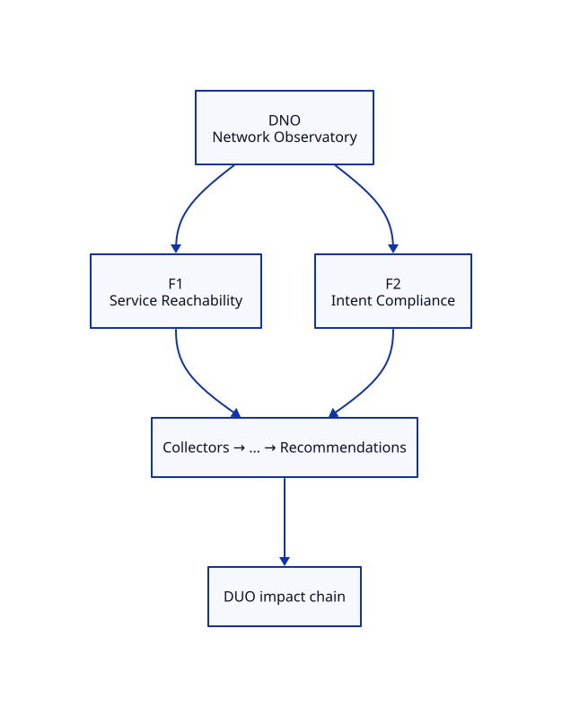

# DNO — Network Observatory Blueprint

**ADR:** 0200 · **Status:** live · **Maturity target:** L1→L4 path

## Mission

Prove existence as a specialization of DOP: measure what commodity tools ignore (Bandwidth alone are inputs only).

## Novel scores

Path Stability, Service Reachability, Intent Compliance, …

## Features (≥2)

| Feature | Novel signal | Five-question focus | Proof |
|---------|--------------|---------------------|-------|
| **Service Reachability** | Service Reachability | What exists?, What changed?, What will happen?, What should I do? | Probe HAProxy→Route→Service for dasmlab.org / DPO FQDN |
| **Intent Compliance** | Intent Compliance | What exists?, Why did it change?, What should I do? | CERT*/ACL intent vs ensure-prod-cert outcomes |

### Feature details

#### F1 — Service Reachability
- **Chain role:** Outage narratives for DUO; complements DPO edge bots
- **Acceptance:** See [USE-CASES.md](./USE-CASES.md)

#### F2 — Intent Compliance
- **Chain role:** Policy complexity → DUO operational impact
- **Acceptance:** See [USE-CASES.md](./USE-CASES.md)

## Dependencies

HAProxy host-first SSH, OCP Routes

## E2E chain role

Edge path health underpins DPO public truth + DUO outages

## Demo steps (local)

1. Open Family tab → locate **DNO** card and two features.
2. Hit APIs listed in USE-CASES.
3. Confirm novel score names appear (never commodity-only heroes).

## ADR-9999 gate

Both features satisfy Measure and/or Correlate and/or Explain; neither is a commodity dashboard.
