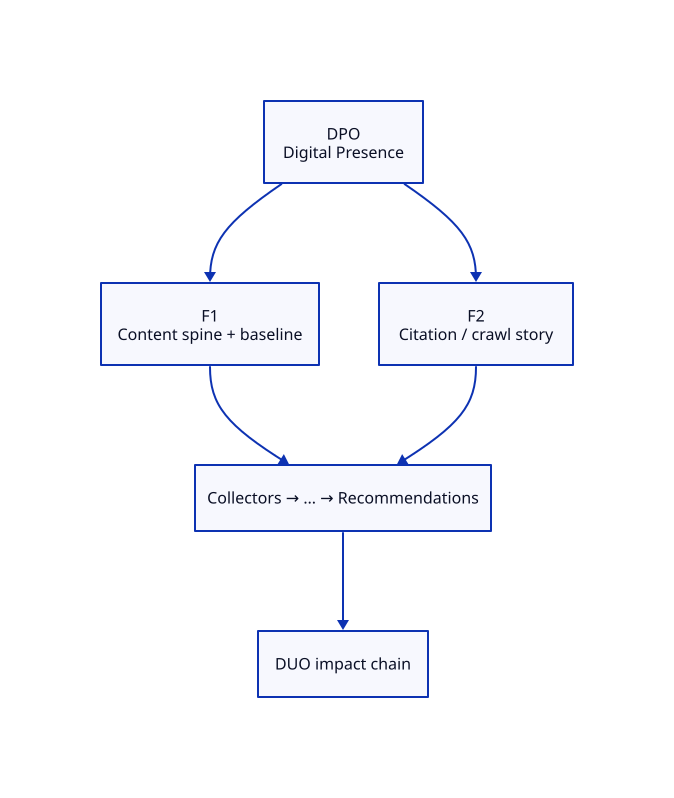

# DPO — Digital Presence Observatory Blueprint

**ADR:** 0400 · **Status:** live · **Maturity target:** L2→L3

## Mission

Prove existence as a specialization of DOP: measure what commodity tools ignore (Clicks, CTR, Rank, Traffic are inputs only).

## Novel scores

AI Citation Velocity, Authority Growth, Topic Coverage, Knowledge Graph Density, Engineering Trust, …

## Features (≥2)

| Feature | Novel signal | Five-question focus | Proof |
|---------|--------------|---------------------|-------|
| **Content spine + baseline diff** | Topic Coverage | What exists?, What changed?, Why did it change?, What should I do? | Sitemap path entities joined to Activity/GSC/edge; POST /baseline + GET /baseline/diff |
| **Citation / crawl story** | AI Citation Velocity inputs | What exists?, What will happen?, What should I do? | Edge UA classes (Googlebot, GPTBot, ClaudeBot, …) + GEO prompt pack scaffold |
| **Campaign orchestration** | Presence publish loop | What exists?, What changed?, What will happen?, What should I do? | ADR-0402 dry-run→arm→send; channel adapters; first campaign `dasmlab-2.0-launch` |

### Feature details

#### F1 — Content spine + baseline diff
- **Chain role:** Emits presence health + baseline labels for DUO and Research
- **Acceptance:** See [USE-CASES.md](./USE-CASES.md)

#### F2 — Citation / crawl story
- **Chain role:** Feeds Research Citation Index and DUO presence line
- **Acceptance:** See [USE-CASES.md](./USE-CASES.md)

#### F3 — Campaign orchestration
- **Chain role:** Creates measurable presence; feeds baselines + DUO
- **Acceptance:** Dry-run renders all Wave-1 channels; `/launch` is web_slash artifact

## Dependencies

Surfing Activity, HAProxy edge, GSC (when secret present), GitHub

## E2E chain role

After home ship → DPO scores/baselines → feeds DUO + Research

## Demo steps (local)

1. Open Family tab → locate **DPO** card and two features.
2. Hit APIs listed in USE-CASES.
3. Confirm novel score names appear (never commodity-only heroes).

## ADR-9999 gate

Both features satisfy Measure and/or Correlate and/or Explain; neither is a commodity dashboard.
