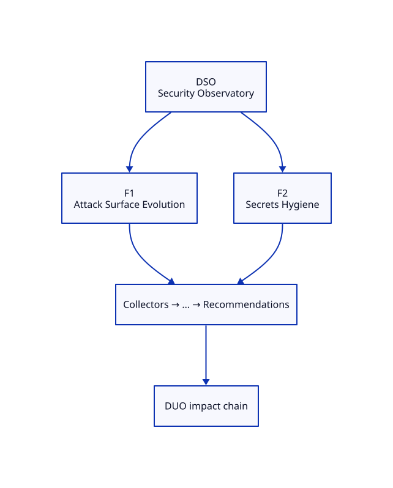

# DSO — Security Observatory Blueprint

**ADR:** 0300 · **Status:** scaffold · **Maturity target:** L2

## Mission

Prove existence as a specialization of DOP: measure what commodity tools ignore (CVE lists alone are inputs only).

## Novel scores

Attack Surface Evolution, Risk Momentum, Secrets Hygiene, …

## Features (≥2)

| Feature | Novel signal | Five-question focus | Proof |
|---------|--------------|---------------------|-------|
| **Attack Surface Evolution** | Attack Surface Evolution | What exists?, What changed?, Why did it change?, What will happen? | Time-diff public Routes/Services/ports for observatory namespaces |
| **Secrets Hygiene** | Secrets Hygiene | What exists?, Why did it change?, What should I do? | Optional/missing keys in dpo-secrets (e.g. GSC) = hygiene debt score |

### Feature details

#### F1 — Attack Surface Evolution
- **Chain role:** FQDN/vanity change → surface delta → DUO risk
- **Acceptance:** See [USE-CASES.md](./USE-CASES.md)

#### F2 — Secrets Hygiene
- **Chain role:** DUO recommends credential fill; stops silent demo SEO
- **Acceptance:** See [USE-CASES.md](./USE-CASES.md)

## Dependencies

K8s API, dpo-secrets inventory

## E2E chain role

DPO vanity/CERT → DSO surface + hygiene

## Demo steps (local)

1. Open Family tab → locate **DSO** card and two features.
2. Hit APIs listed in USE-CASES.
3. Confirm novel score names appear (never commodity-only heroes).

## ADR-9999 gate

Both features satisfy Measure and/or Correlate and/or Explain; neither is a commodity dashboard.
