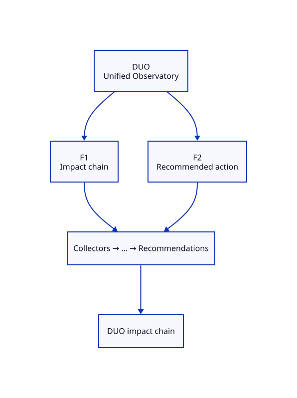

# DUO — Unified Observatory Blueprint

**ADR:** 0700 · **Status:** scaffold · **Maturity target:** L3→L5

## Mission

Prove existence as a specialization of DOP: measure what commodity tools ignore (Aggregated dashboards are inputs only).

## Novel scores

Business Impact, Engineering Impact, Operational Impact, Recommended Actions

## Features (≥2)

| Feature | Novel signal | Five-question focus | Proof |
|---------|--------------|---------------------|-------|
| **Impact chain view** | Business→Engineering→Operational | What exists?, What changed?, Why did it change?, What will happen?, What should I do? | GET /api/v1/duo/impact composes DPO + sibling stub scores |
| **Recommended action card** | Recommended Actions | Why did it change?, What should I do? | GET /api/v1/duo/recommend — ADR-0006 shape with ≥2 product evidence |

### Feature details

#### F1 — Impact chain view
- **Chain role:** Executive ending of E2E demo
- **Acceptance:** See [USE-CASES.md](./USE-CASES.md)

#### F2 — Recommended action card
- **Chain role:** Closes five-question loop for leadership
- **Acceptance:** See [USE-CASES.md](./USE-CASES.md)

## Dependencies

≥2 products emitting scores via family/compose

## E2E chain role

Consumes all lanes; produces one action

## Demo steps (local)

1. Open Family tab → locate **DUO** card and two features.
2. Hit APIs listed in USE-CASES.
3. Confirm novel score names appear (never commodity-only heroes).

## ADR-9999 gate

Both features satisfy Measure and/or Correlate and/or Explain; neither is a commodity dashboard.
